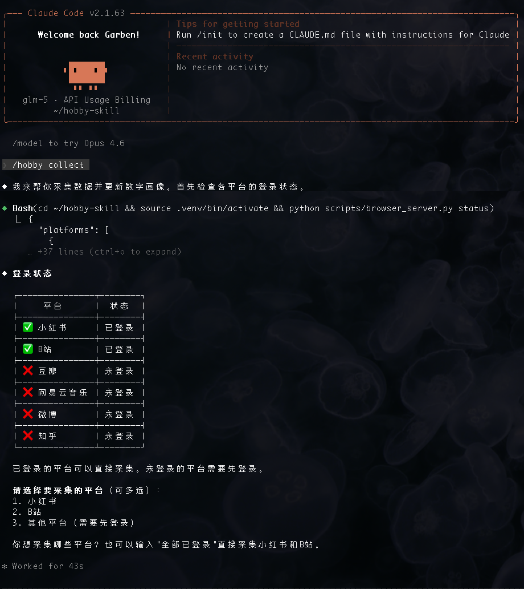
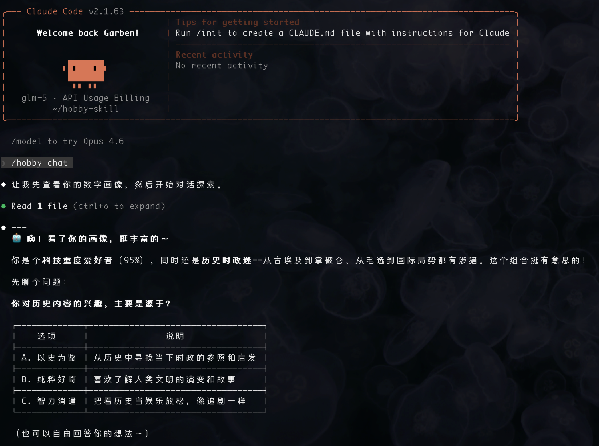
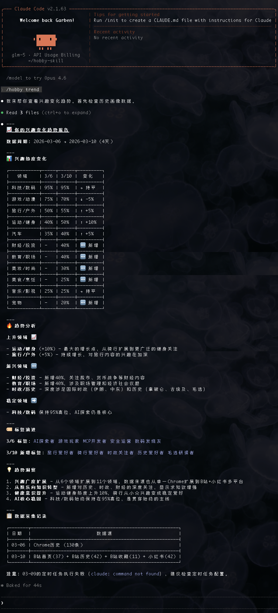
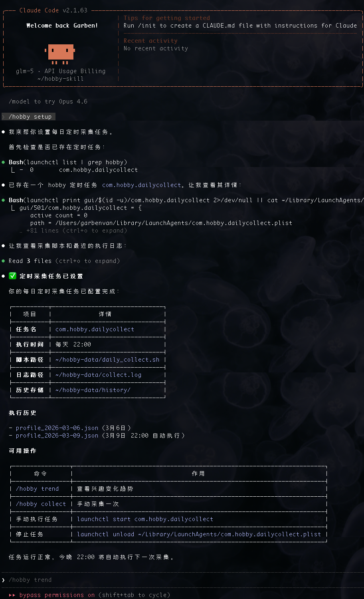

# Hobby-Skill - 个人兴趣与性格分析

<div align="center">

**通过分析数字足迹认识自己**

[](https://opensource.org/licenses/MIT)
[](https://www.python.org/)
[](https://claude.ai/code)

[English](./README_EN.md) | 简体中文

</div>

---

## 这是什么？

你是否好奇：**我在网上浏览的内容，能反映我是怎样的人？**

Hobby-Skill 是一个本地优先的工具，通过分析你在小红书、B站、微博、知乎等平台的浏览、点赞、收藏记录，自动推断你的兴趣爱好和性格特征。

**核心原则：所有数据处理在本地完成，不上传任何个人数据。**

---

## 功能亮点

| 功能 | 描述 |
|------|------|
| **数据采集** | 从小红书、B站、微博、知乎等平台采集浏览/点赞/收藏数据 |
| **兴趣分析** | 自动归类到12个领域（科技/数码、美妆/时尚、游戏/动漫等） |
| **性格推断** | 基于大五人格模型推断性格特征 |
| **对话探索** | 通过问答深入了解自己的兴趣和性格 |
| **趋势追踪** | 查看兴趣随时间的变化趋势 |
| **定时采集** | 支持每日自动采集更新 |

---

## 效果展示

### `/hobby collect` - 采集数据并生成画像


### `/hobby chat` - 对话深入了解自己


### `/hobby trend` - 查看兴趣变化趋势


### `/hobby setup` - 设置每日定时采集


---

## 快速开始

### 1. 安装依赖

```bash
cd ~/hobby-skill
python -m venv .venv
source .venv/bin/activate
pip install playwright
playwright install chromium
```

### 2. 作为 Claude Code Skill 使用

1. 复制 `SKILL.md` 到 `~/.claude/skills/hobby/SKILL.md`
2. 在 Claude Code 中执行 `/hobby` 命令

### 3. 可用命令

| 命令 | 功能 |
|------|------|
| `/hobby collect` | 采集数据并更新数字画像 |
| `/hobby chat` | 通过对话深入了解自己 |
| `/hobby trend` | 查看兴趣变化趋势 |
| `/hobby setup` | 设置每日定时采集 |

---

## 支持的平台

| 平台 | 可采集页面 |
|------|------------|
| 小红书 | 发现、我的点赞、我的收藏 |
| B站 | 首页、历史记录、我的收藏 |
| 微博 | 首页、我的收藏 |
| 知乎 | 首页、热榜、我的收藏 |

---

## 分析维度

### 兴趣分类（12领域）
科技/数码、美妆/时尚、游戏/动漫、美食/烹饪、旅行/户外、音乐/影视、运动/健身、财经/投资、教育/职场、家居/生活、宠物、汽车

### 性格推断（大五人格）
开放性、尽责性、外向性、宜人性、神经质

---

## 数据目录

默认使用 `~/hobby-data` 存储用户数据，可通过环境变量自定义：

```bash
export HOBBY_DATA_DIR=~/my-custom-data-dir
```

数据目录结构：
```
~/hobby-data/
├── crawled/                    # 爬取的原始数据
├── history/                    # 历史画像
├── conversations/              # 对话记录
├── hotspots_cache.json         # 热点缓存
└── current_profile.json        # 当前画像
```

---

## 使用场景

- **自我认知** - 发现自己真正的兴趣所在
- **时间追踪** - 了解自己的上网习惯和时间分配
- **性格探索** - 基于行为数据而非主观问卷了解自己
- **趋势观察** - 追踪兴趣随时间的变化

---

## 隐私说明

- **本地优先** - 所有数据处理在本地完成
- **数据隔离** - 用户数据与代码隔离存储
- **完全控制** - 用户可随时删除所有数据
- **不上传** - 不上传任何个人信息到云端

---

## Roadmap

- [ ] 支持更多平台（抖音、快手等）
- [ ] Web 可视化界面
- [ ] 导出报告（PDF/HTML）
- [ ] 多设备数据同步
- [ ] AI 洞察建议

---

## 贡献

欢迎提交 Issue 和 Pull Request！

---

## 许可证

[MIT License](LICENSE)
